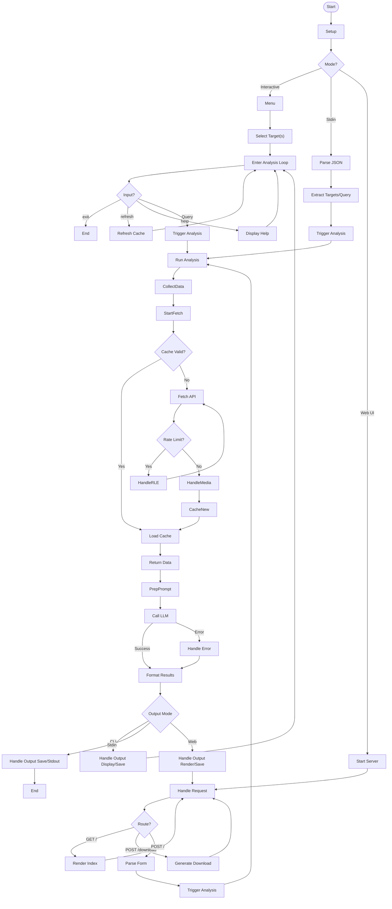

# 🚀 SocialOSINTLM - Web Interface

**SocialOSINTLM** is a powerful Open Source Intelligence (OSINT) gathering and analysis tool, now accessible through a user-friendly **web interface**. It aggregates and analyses user activity across multiple social media platforms, including **Twitter / X, Reddit, Hacker News (via Algolia), and Bluesky**. Leveraging AI through the OpenRouter API, it provides comprehensive insights into user engagement, content themes, behavioral patterns, and media content analysis, all within your browser.

## 🌟 Key Features

✅ **Web-Based UI:** Interact with the tool easily through a clean web interface (Flask + Pico.css).

✅ **Multi-Platform Data Collection:** Aggregates data from Twitter/X, Reddit, Hacker News (via Algolia API), and Bluesky.

✅ **AI-Powered Analysis:** Utilises configurable models via the OpenRouter API for sophisticated text and image analysis.

✅ **Structured AI Prompts:** Employs detailed system prompts for objective, evidence-based analysis focusing on behavior, semantics, interests, and communication style.

✅ **Vision-Capable Image Analysis:** Analyses downloaded images (`JPEG, PNG, GIF, WEBP`) for OSINT insights using a vision-enabled LLM, focusing on objective details.

✅ **Efficient Media Handling:** Backend downloads media, stores it locally, handles platform-specific authentication, processes Reddit galleries, and resizes large images (max 1536x1536) for analysis.

✅ **Cross-Account Comparison:** Analyse profiles across multiple selected platforms simultaneously via the web form.

✅ **Intelligent Rate Limit Handling:** Backend detects API rate limits, provides informative feedback via flash messages in the UI, and prevents excessive requests. Raises `RateLimitExceededError` internally.

✅ **Robust Caching System:** Caches fetched data for 24 hours (`data/cache/`) to reduce API calls and speed up subsequent analyses via the web interface. Media files are cached in `data/media/`.

✅ **Browser Results:** Analysis results are rendered directly in the browser as formatted HTML.

✅ **Optional Report Saving:** Choose to automatically save detailed Markdown reports (`data/outputs/`).

✅ **Downloadable Reports:** Download generated Markdown reports directly from the results page.

✅ **Configurable Fetch Limits:** Backend fetches a defined number of recent items per platform to balance depth and API usage.

✅ **Detailed Logging:** Logs errors and operational details to `analyser_web.log` (web interface) and `analyser.log` (core library).

✅ **Environment Variable Configuration:** Easy setup using environment variables or a `.env` file.


## 🛠 Installation

### Prerequisites
*   **Python 3.8+**
*   Pip (Python package installer)

### Steps
1.  **Clone the repository (if you haven't already):**
    ```bash
    git clone https://github.com/bm-github/SocialOSINTLM.git
    cd SocialOSINTLM
    ```
2.  **Install dependencies:**
    ```bash
    pip install -r requirements.txt
    ```
    *(This includes Flask for the web server and other core dependencies.)*

3.  **Set up Environment Variables:**
    Create a `.env` file in the project root or export the following environment variables:

    ```sh
    # --- Platform API Keys ---
    # Twitter/X (Requires Elevated/Academic access for user tweet lookups)
    export TWITTER_BEARER_TOKEN='your_twitter_v2_bearer_token'

    # Reddit (Create an app at https://www.reddit.com/prefs/apps)
    export REDDIT_CLIENT_ID='your_reddit_client_id'
    export REDDIT_CLIENT_SECRET='your_reddit_client_secret'
    export REDDIT_USER_AGENT='YourWebAppName/1.0 by YourUsername' # Customise this

    # Bluesky (Generate an App Password in Bluesky settings)
    export BLUESKY_IDENTIFIER='your-handle.bsky.social' # Your full Bluesky handle
    export BLUESKY_APP_SECRET='xxxx-xxxx-xxxx-xxxx' # Your generated App Password

    # --- AI Analysis API ---
    # OpenRouter (Get API Key from https://openrouter.ai)
    export OPENROUTER_API_KEY='your_openrouter_api_key'

    # --- AI Model Selection (OpenRouter Compatible) ---
    # Model for text analysis
    export ANALYSIS_MODEL='google/gemini-2.0-flash-001'
    # Vision-capable model for image analysis
    export IMAGE_ANALYSIS_MODEL='openai/gpt-4o-mini' # Must support vision

    # --- Web Application Secret Key ---
    # Used by Flask for session management (flash messages)
    export FLASK_SECRET_KEY='generate_a_strong_random_secret_key_here'
    ```
    *Note: The script automatically loads variables from a `.env` file if present.*

## 🚀 Usage

### Running the Web Server
1.  Navigate to the project directory in your terminal.
2.  Ensure your `.env` file is correctly configured with API keys and `FLASK_SECRET_KEY`.
3.  Run the Flask application:
    ```bash
    python app.py
    ```
4.  By default, the application will be available at `http://127.0.0.1:5000`. Open this address in your web browser.

### Using the Web Interface
1.  The homepage presents a form to input analysis details.
2.  **Select Platforms & Usernames:** For each platform you want to query, enter the relevant username(s) in the corresponding input field. Separate multiple usernames for the *same* platform with commas.
    *   **Twitter:** Usernames *without* the leading `@`.
    *   **Reddit:** Usernames *without* the leading `u/`.
    *   **Hacker News:** Usernames as they appear.
    *   **Bluesky:** Full handles including `.bsky.social` (or custom domain).
3.  **Enter Analysis Query:** In the text area, describe what information you want the AI to extract or analyse (e.g., "Analyse recent activity patterns", "Identify key interests based on text and images", "Assess communication tone").
4.  **Auto-Save Option:** Check the box if you want the generated Markdown report to be automatically saved to the `data/outputs/` directory on the server upon successful analysis.
5.  **Run Analysis:** Click the "Run Analysis" button. The button will indicate that analysis is in progress. Please be patient, as fetching data and AI analysis can take some time.
6.  **View Results:** If successful, you will be redirected to a results page displaying the formatted analysis report. If errors occur (e.g., rate limits, user not found), appropriate messages will be displayed on the page.
7.  **Report Page Options:** On the results page, you can:
    *   View the report rendered as HTML.
    *   Expand a section to view and copy the raw Markdown source.
    *   Download the report as a `.md` file.
    *   Navigate back to the homepage to start a new analysis.

## 📊 Output
*   Analysis results are displayed **in the browser** on the report page, formatted as HTML.
*   If the "Auto-save" option is checked during submission, successful reports are saved to the `data/outputs/` directory on the server.
*   Saved filename format: `analysis_YYYYMMDD_HHMMSS_{platforms}_{query_preview}.md`.

## ⚡ Cache System
*   **Text/API Data:** Fetched platform data is cached for **24 hours** in `data/cache/` as JSON files (`{platform}_{username}.json`). This minimizes redundant API calls and speeds up subsequent web requests for the same user within the expiry window.
*   **Media Files:** Downloaded images and media are stored in `data/media/` using hashed filenames (`{hash}.jpg`, etc.). These are reused if the same URL is encountered, further speeding up analysis involving previously seen images.
*   The cache operates automatically in the background. There is no manual 'refresh' button in the web UI; fetching happens if cache is missing or expired.

## 🔍 Error Handling & Logging
*   **API Errors & Rate Limits:** Handled by the backend. Errors like User Not Found, Access Forbidden, or Rate Limits are caught and displayed as user-friendly **flash messages** in the web interface. Rate limit messages may include estimated wait times where available (e.g., from Twitter).
*   **Web App Logging:** Operational details and errors specific to the Flask web server are logged to `analyser_web.log`.
*   **Core Library Logging:** Deeper errors related to data fetching, processing, or core analysis are logged to `analyser.log`. Check both logs for comprehensive debugging.

## 🤖 AI Analysis Details
*   **Text Analysis:**
    *   Uses the model specified by `ANALYSIS_MODEL`.
    *   Receives **formatted summaries** of fetched data (user info, stats, recent post/comment text snippets, media presence indicators) per platform.
    *   Guided by a detailed **system prompt** focusing on objective, evidence-based analysis.
*   **Image Analysis:**
    *   Uses the vision-capable model specified by `IMAGE_ANALYSIS_MODEL`.
    *   Images larger than 1536x1536 are resized before analysis.
    *   Guided by a specific **prompt** requesting objective identification of key OSINT-relevant elements.
*   **Integration:** The final text analysis incorporates insights derived from both the formatted text data summaries and the individual image analysis reports, triggered via the web form submission.

## 📸 Media Processing Details
*   The backend downloads media files (images: `JPEG, PNG, GIF, WEBP`) linked in posts/tweets.
*   Stores files locally in `data/media/`.
*   Handles platform-specific access (Twitter Bearer Token, Bluesky Authenticated CDN URLs, Reddit Galleries).
*   Analyses valid downloaded images using the vision LLM.

## 🔒 Security Considerations
*   **API Keys:** Requires potentially sensitive API keys and secrets stored as environment variables or in a `.env` file. Ensure this file is secured and **never** commit it to version control (`.gitignore` should include `.env`).
*   **Flask Secret Key:** The `FLASK_SECRET_KEY` is crucial for securing sessions. Use a strong, unique, randomly generated key.
*   **Data Caching:** Fetched data and downloaded media are stored locally in the `data/` directory. Be mindful of the sensitivity of the data being analysed and secure the directory appropriately.
*   **Web Application Security:** The provided Flask app is basic. For deployment beyond local use, consider standard web security practices (e.g., running behind a production-grade web server like Gunicorn/Nginx, HTTPS, input validation, rate limiting on the web endpoint itself).
*   **Terms of Service:** Ensure your use of the tool complies with the Terms of Service of each social media platform and the OpenRouter API. Automated querying can be subject to restrictions.

## 🤝 Contributing
Contributions are welcome! Please feel free to submit pull requests, report issues, or suggest enhancements via the project's issue tracker.

## 📜 License
This project is licensed under the **MIT License**. See the `LICENSE` file for details.